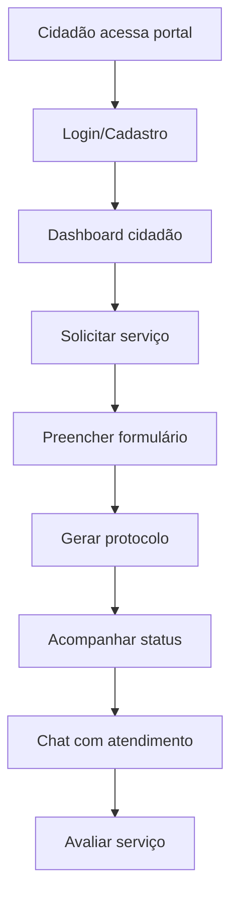
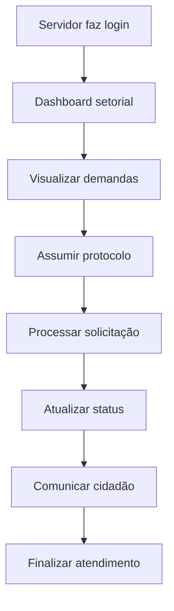
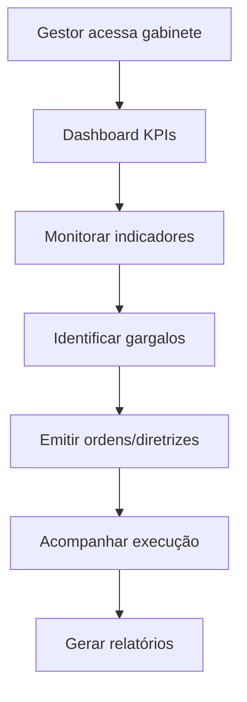

# DigiUrban - Especificação Funcional e Modelo de Negócio

## 📋 Índice

1. [Visão Geral da Aplicação](#visão-geral-da-aplicação)
2. [Estrutura Funcional](#estrutura-funcional)
3. [Tipos de Usuários e Permissões](#tipos-de-usuários-e-permissões)
4. [Módulos e Funcionalidades](#módulos-e-funcionalidades)
5. [Fluxos de Usuário](#fluxos-de-usuário)
6. [Sistema de Protocolos](#sistema-de-protocolos)
7. [Infraestrutura Técnica](#infraestrutura-técnica)
8. [Modelo de Negócio](#modelo-de-negócio)
9. [Proposta de Valor](#proposta-de-valor)
10. [Roadmap de Desenvolvimento](#roadmap-de-desenvolvimento)

---

## 🎯 Visão Geral da Aplicação

**DigiUrban** é uma plataforma SaaS de gestão municipal integrada que digitaliza e moderniza os processos administrativos de prefeituras, oferecendo um ecossistema completo para:

- **Gestão de atendimento ao cidadão**
- **Administração de serviços municipais**
- **Controle de protocolos e demandas**
- **Comunicação integrada entre setores**
- **Dashboard executivo para tomada de decisões**

### Objetivo Principal
Transformar prefeituras em organizações digitais eficientes, melhorando a experiência do cidadão e otimizando a gestão pública municipal.

---

## 🏗️ Estrutura Funcional

### Arquitetura de 3 Camadas

#### 1. **Camada do Cidadão**
- Portal público de serviços
- Abertura e acompanhamento de protocolos
- Chat direto com atendimento
- Consulta de serviços disponíveis

#### 2. **Camada Operacional (Servidores)**
- Atendimento de demandas
- Gestão setorial específica
- Execução de serviços municipais
- Comunicação interna

#### 3. **Camada Executiva (Gestão)**
- Dashboard estratégico
- Relatórios gerenciais
- Controle de metas e KPIs
- Visão global da administração

---

## 👥 Tipos de Usuários e Permissões

### Hierarquia de Usuários

```
Super Admin
    ├── Admin
    ├── Secretário
    │   ├── Diretor
    │   │   ├── Coordenador
    │   │   │   ├── Funcionário
    │   │   │   └── Atendente
    │   │   └── Funcionário
    │   └── Funcionário
    └── Cidadão
```

#### 🔹 **Super Admin**
- **Acesso:** Completo a todo o sistema
- **Função:** Configuração global, gerenciamento de usuários, auditoria
- **Páginas:** Todas + configurações avançadas

#### 🔹 **Admin** 
- **Acesso:** Administrativo geral
- **Função:** Gestão de usuários, relatórios, configurações
- **Páginas:** Administração, relatórios, gabinete (parcial)

#### 🔹 **Secretário**
- **Acesso:** Secretaria específica + gabinete
- **Função:** Gestão setorial, relatórios da pasta
- **Páginas:** Módulo da secretaria + gabinete + relatórios

#### 🔹 **Diretor/Coordenador/Funcionário**
- **Acesso:** Módulo específico da secretaria
- **Função:** Execução de atividades setoriais
- **Páginas:** Módulo da secretaria + atendimentos

#### 🔹 **Atendente**
- **Acesso:** Atendimento e protocolos
- **Função:** Recepção de demandas, primeiro atendimento
- **Páginas:** Atendimentos + chat + protocolos básicos

#### 🔹 **Cidadão**
- **Acesso:** Portal público
- **Função:** Solicitação de serviços, acompanhamento
- **Páginas:** Dashboard, protocolos, chat, serviços

---

## 🏛️ Módulos e Funcionalidades

### 🏢 **1. Gabinete do Prefeito**
**Objetivo:** Visão estratégica e controle executivo

#### Funcionalidades:
- **Atendimentos:** Demandas direcionadas ao gabinete
- **Visão Geral:** Dashboard executivo com KPIs
- **Mapa de Demandas:** Visualização geográfica de solicitações
- **Relatórios Executivos:** Indicadores de gestão
- **Ordens aos Setores:** Coordenação de ações entre secretarias
- **Gerenciar Permissões:** Controle de acesso (Super Admin)
- **Projetos Estratégicos:** Acompanhamento de grandes projetos
- **Agenda Executiva:** Calendário e compromissos
- **Monitoramento KPIs:** Métricas de performance
- **Comunicação Oficial:** Gestão de comunicados
- **Auditoria e Transparência:** Controles internos

### 🏥 **2. Secretaria de Saúde**
**Objetivo:** Gestão completa do sistema de saúde municipal

#### Funcionalidades:
- **Atendimentos:** Solicitações relacionadas à saúde
- **Agendamentos Médicos:** Sistema de marcação de consultas
- **Controle de Medicamentos:** Estoque e distribuição
- **Campanhas de Saúde:** Gestão de campanhas preventivas
- **Programas de Saúde:** PSF, ESF, programas específicos
- **Encaminhamentos TFD:** Tratamento Fora do Domicílio
- **Exames:** Agendamento e controle de exames
- **ACS:** Gestão de Agentes Comunitários de Saúde
- **Transporte de Pacientes:** Logística de ambulâncias

### 🎓 **3. Secretaria de Educação**
**Objetivo:** Administração do sistema educacional municipal

#### Funcionalidades:
- **Matrícula de Alunos:** Sistema de inscrições escolares
- **Gestão Escolar:** Administração de unidades educacionais
- **Transporte Escolar:** Logística e rotas
- **Merenda Escolar:** Controle nutricional e distribuição
- **Registro de Ocorrências:** Eventos e disciplina escolar
- **Calendário Escolar:** Planejamento letivo

### 🤝 **4. Secretaria de Assistência Social**
**Objetivo:** Programas sociais e proteção à família

#### Funcionalidades:
- **Atendimentos:** Demandas sociais
- **Famílias Vulneráveis:** Cadastro e acompanhamento
- **CRAS e CREAS:** Gestão dos centros de referência
- **Programas Sociais:** Bolsa Família, auxílios municipais
- **Gerenciamento de Benefícios:** Controle de beneficiários
- **Entregas Emergenciais:** Distribuição de cestas e auxílios
- **Registro de Visitas:** Acompanhamento domiciliar

### 🎨 **5. Secretaria de Cultura**
**Objetivo:** Fomento e gestão cultural municipal

#### Funcionalidades:
- **Espaços Culturais:** Gestão de equipamentos culturais
- **Projetos Culturais:** Editais e financiamentos
- **Eventos:** Organização de festivais e apresentações
- **Grupos Artísticos:** Cadastro e apoio a artistas locais
- **Manifestações Culturais:** Patrimônio cultural
- **Oficinas e Cursos:** Formação cultural

### 🛡️ **6. Secretaria de Segurança Pública**
**Objetivo:** Segurança urbana e ordem pública

#### Funcionalidades:
- **Atendimentos:** Demandas de segurança
- **Registro de Ocorrências:** Boletins e relatórios
- **Apoio da Guarda:** Coordenação da guarda municipal
- **Mapa de Pontos Críticos:** Mapeamento de violência
- **Alertas de Segurança:** Sistema de comunicação
- **Estatísticas Regionais:** Indicadores de criminalidade
- **Vigilância Integrada:** Monitoramento urbano

### 🏙️ **7. Secretaria de Planejamento Urbano**
**Objetivo:** Desenvolvimento e ordenamento territorial

#### Funcionalidades:
- **Atendimentos:** Questões urbanísticas
- **Aprovação de Projetos:** Análise técnica de obras
- **Emissão de Alvarás:** Licenciamento urbano
- **Reclamações e Denúncias:** Irregularidades urbanas
- **Consultas Públicas:** Participação cidadã
- **Mapa Urbano:** Geoprocessamento e zoneamento

### 🚧 **8. Secretaria de Obras Públicas**
**Objetivo:** Infraestrutura e obras municipais

#### Funcionalidades:
- **Atendimentos:** Solicitações de obras
- **Obras e Intervenções:** Gestão de projetos
- **Progresso de Obras:** Acompanhamento de execução
- **Mapa de Obras:** Visualização geográfica

### 🔧 **9. Secretaria de Serviços Públicos**
**Objetivo:** Manutenção urbana e serviços essenciais

#### Funcionalidades:
- **Atendimentos:** Demandas de manutenção
- **Iluminação Pública:** Gestão de postes e reparos
- **Limpeza Urbana:** Coleta e limpeza
- **Coleta Especial:** Entulho e materiais especiais
- **Problemas com Foto:** Registro fotográfico de problemas
- **Programação de Equipes:** Logística operacional

### 🌱 **10. Outras Secretarias**
- **Agricultura:** Apoio rural e produtores
- **Esportes:** Equipamentos e programas esportivos
- **Turismo:** Fomento turístico local
- **Habitação:** Programas habitacionais
- **Meio Ambiente:** Licenciamento e preservação

---

## 🔄 Fluxos de Usuário

### Fluxo do Cidadão



### Fluxo do Servidor



### Fluxo Executivo



---

## 📋 Sistema de Protocolos

### Estrutura do Protocolo

```
PROT-2025-0000001
  ├── Dados do Solicitante
  ├── Serviço Solicitado
  ├── Descrição da Demanda
  ├── Documentos Anexos
  ├── Localização (se aplicável)
  ├── Prazo de Resposta
  ├── Secretaria Responsável
  ├── Status Atual
  └── Histórico de Movimentações
```

### Status de Protocolos

1. **Aberto** - Protocolo criado
2. **Em Andamento** - Sendo processado
3. **Aguardando Documentos** - Pendência documental
4. **Aguardando Aprovação** - Em análise superior
5. **Aprovado** - Aprovado para execução
6. **Rejeitado** - Negado com justificativa
7. **Concluído** - Serviço finalizado
8. **Cancelado** - Cancelado pelo solicitante

### Tipos de Serviços

#### 🏛️ **Administrativos**
- Certidões diversas
- Segunda via de documentos
- Informações gerais

#### 🏥 **Saúde**
- Agendamento médico
- Solicitação de medicamentos
- Transporte para tratamento

#### 🎓 **Educação**
- Matrícula escolar
- Transporte escolar
- Solicitação de vagas

#### 🚧 **Infraestrutura**
- Reparos em vias públicas
- Problemas de iluminação
- Limpeza urbana

#### 🏠 **Habitação e Urbanismo**
- Alvarás de construção
- Regularização fundiária
- Denúncias urbanísticas

---

## 🔧 Infraestrutura Técnica

### Stack Tecnológico

- **Frontend:** React + TypeScript + Tailwind CSS
- **Backend:** Supabase (PostgreSQL + Auth + Storage)
- **Autenticação:** Row Level Security (RLS)
- **Real-time:** WebSockets para chat
- **Storage:** Arquivos e documentos
- **Deploy:** Vercel/Netlify

### Banco de Dados

#### Tabelas Principais:
- `user_profiles` - Perfis de usuários
- `secretarias` - Estrutura organizacional
- `setores` - Departamentos internos
- `servicos_municipais` - Catálogo de serviços
- `protocolos` - Protocolos de atendimento
- `protocolos_historico` - Auditoria de movimentações
- `chat_rooms` - Salas de chat
- `chat_messages` - Mensagens
- `notificacoes` - Sistema de notificações

---

## 💼 Modelo de Negócio

### 🎯 Proposta de Valor

#### Para Prefeituras:
- **Digitalização completa** dos processos administrativos
- **Redução de custos** operacionais
- **Melhoria na transparência** e controle
- **Otimização do atendimento** ao cidadão
- **Dashboard executivo** para tomada de decisões
- **Compliance** com leis de transparência

#### Para Cidadãos:
- **Acesso 24/7** aos serviços municipais
- **Acompanhamento em tempo real** de solicitações
- **Redução de filas** e deslocamentos
- **Comunicação direta** com a prefeitura
- **Transparência** nos processos

### 💰 Estratégias de Monetização

#### 1. **SaaS por Assinatura (Principal)**
- **Plano Básico:** R$ 2.500/mês
  - Até 10.000 habitantes
  - Módulos essenciais
  - 3 secretarias ativas
  - Suporte por email

- **Plano Profissional:** R$ 5.000/mês
  - Até 50.000 habitantes
  - Todos os módulos
  - Secretarias ilimitadas
  - Chat integrado
  - Suporte telefônico

- **Plano Enterprise:** R$ 10.000/mês
  - Habitantes ilimitados
  - Personalização avançada
  - Integrações personalizadas
  - Gestor de conta dedicado
  - SLA garantido

#### 2. **Serviços Adicionais**
- **Setup e Migração:** R$ 5.000 - R$ 15.000
- **Treinamento:** R$ 2.000/dia
- **Customização:** R$ 500/hora
- **Integração com sistemas externos:** R$ 10.000 - R$ 50.000
- **Desenvolvimento de módulos específicos:** A partir de R$ 20.000

#### 3. **Marketplace de Módulos**
- Módulos especializados desenvolvidos por parceiros
- Comissão de 30% sobre vendas
- Certificação de qualidade

### 🎯 Público-Alvo

#### Primário:
- **Prefeituras de pequeno e médio porte** (5.000 - 100.000 habitantes)
- Regiões: Sul, Sudeste, Centro-Oeste
- Perfil: Gestões modernizadoras

#### Secundário:
- **Prefeituras grandes** (100.000+ habitantes) - versão enterprise
- **Câmaras municipais** - módulo legislativo
- **Autarquias municipais** - versão específica

### 📈 Potencial de Mercado

#### Dados do Mercado:
- **5.570 municípios** no Brasil
- **85% são pequenos e médios** (até 100.000 habitantes)
- **Mercado de GovTech** em crescimento de 20% a.a.
- **Penetração atual** de soluções digitais: <15%

#### Projeção de Receita (5 anos):
- **Ano 1:** 50 clientes = R$ 3M ARR
- **Ano 2:** 150 clientes = R$ 9M ARR
- **Ano 3:** 300 clientes = R$ 18M ARR
- **Ano 4:** 500 clientes = R$ 30M ARR
- **Ano 5:** 750 clientes = R$ 45M ARR

### 🚀 Estratégia de Go-to-Market

#### 1. **Vendas Diretas**
- Equipe de inside sales
- Participação em eventos municipalistas
- Parcerias com consultores públicos

#### 2. **Marketing Digital**
- Content marketing sobre gestão pública
- SEO para termos relacionados
- Webinars e demos

#### 3. **Parcerias Estratégicas**
- **Federação de Municípios**
- **Empresas de contabilidade pública**
- **Consultorias especializadas**
- **Associações de prefeitos**

#### 4. **Freemium Strategy**
- Versão gratuita limitada
- Conversão para planos pagos

---

## 📊 Indicadores de Sucesso

### KPIs do Produto:
- **NPS (Net Promoter Score):** >50
- **Churn Rate:** <5% mensal
- **Time to Value:** <30 dias
- **Adoção de módulos:** >80%

### KPIs de Negócio:
- **ARR (Annual Recurring Revenue)**
- **CAC (Customer Acquisition Cost)**
- **LTV (Lifetime Value)**
- **Monthly Growth Rate:** >15%

---

## 🛤️ Roadmap de Desenvolvimento

### 📅 Fase 1 - MVP (3 meses)
- [x] Sistema de autenticação
- [x] Dashboard básico
- [x] Chat integrado
- [x] Upload de arquivos
- [ ] Sistema de protocolos completo
- [ ] Módulo de atendimento funcional
- [ ] Landing page comercial

### 📅 Fase 2 - Produto Viável (6 meses)
- [ ] 3 módulos setoriais completos (Saúde, Educação, Obras)
- [ ] Sistema de relatórios
- [ ] Notificações push
- [ ] App mobile (PWA)
- [ ] Integração com pagamentos

### 📅 Fase 3 - Escala (12 meses)
- [ ] Todos os módulos implementados
- [ ] Dashboard executivo avançado
- [ ] API pública
- [ ] Marketplace de integrações
- [ ] BI integrado

### 📅 Fase 4 - Expansão (18 meses)
- [ ] Módulo para Câmaras Municipais
- [ ] Integração com sistemas federais
- [ ] IA para automação de processos
- [ ] Expansão internacional

---

## 🎯 Próximos Passos Imediatos

### Para o Desenvolvedor:
1. **Implementar sistema de protocolos completo**
2. **Definir lógica de atendimento e fluxos**
3. **Criar módulo de serviços municipais**
4. **Desenvolver dashboard executivo**
5. **Implementar sistema de relatórios**

### Para o Negócio:
1. **Validar MVP com 2-3 prefeituras piloto**
2. **Refinar pricing e positioning**
3. **Criar material de vendas**
4. **Montar equipe comercial**
5. **Estabelecer parcerias estratégicas**

---

## 💡 Conclusão

O **DigiUrban** representa uma oportunidade significativa no mercado de GovTech brasileiro, oferecendo uma solução completa e moderna para a gestão municipal. Com um modelo de negócio escalável e uma proposta de valor clara, a plataforma está posicionada para se tornar a principal solução de digitalização para prefeituras brasileiras.

A estrutura atual já demonstra maturidade técnica e visão abrangente, necessitando agora de foco na implementação das funcionalidades core e validação de mercado para atingir seu potencial comercial.

---

**Documento criado em:** `{data}`  
**Versão:** 1.0  
**Status:** Draft para Revisão