# DigiUrban - Especificação Funcional e Modelo de Negócio

## 📋 Índice

1. [Visão Geral da Aplicação](#visão-geral-da-aplicação)
2. [Estrutura Funcional](#estrutura-funcional)
3. [Tipos de Usuários e Permissões](#tipos-de-usuários-e-permissões)
4. [Módulos e Funcionalidades](#módulos-e-funcionalidades)
5. [Fluxos de Usuário](#fluxos-de-usuário)
6. [Sistema de Protocolos](#sistema-de-protocolos)
7. [Infraestrutura Técnica](#infraestrutura-técnica)
8. [Modelo de Negócio](#modelo-de-negócio)
9. [Proposta de Valor](#proposta-de-valor)
10. [Roadmap de Desenvolvimento](#roadmap-de-desenvolvimento)

---

## 🎯 Visão Geral da Aplicação

**DigiUrban** é uma plataforma SaaS de gestão municipal integrada que digitaliza e moderniza os processos administrativos de prefeituras, oferecendo um ecossistema completo para:

- **Gestão de atendimento ao cidadão**
- **Administração de serviços municipais**
- **Controle de protocolos e demandas**
- **Comunicação integrada entre setores**
- **Dashboard executivo para tomada de decisões**

### Objetivo Principal
Transformar prefeituras em organizações digitais eficientes, melhorando a experiência do cidadão e otimizando a gestão pública municipal.

---

## 🏗️ Estrutura Funcional

### Arquitetura de 3 Camadas

#### 1. **Camada do Cidadão**
- Portal público de serviços
- Abertura e acompanhamento de protocolos
- Chat direto com atendimento
- Consulta de serviços disponíveis

#### 2. **Camada Operacional (Servidores)**
- Atendimento de demandas
- Gestão setorial específica
- Execução de serviços municipais
- Comunicação interna

#### 3. **Camada Executiva (Gestão)**
- Dashboard estratégico
- Relatórios gerenciais
- Controle de metas e KPIs
- Visão global da administração

---

## 👥 Tipos de Usuários e Permissões

### Hierarquia de Usuários

```
Super Admin
    ├── Admin
    ├── Secretário
    │   ├── Diretor
    │   │   ├── Coordenador
    │   │   │   ├── Funcionário
    │   │   │   └── Atendente
    │   │   └── Funcionário
    │   └── Funcionário
    └── Cidadão
```

#### 🔹 **Super Admin**
- **Acesso:** Completo a todo o sistema
- **Função:** Configuração global, gerenciamento de usuários, auditoria
- **Páginas:** Todas + configurações avançadas

#### 🔹 **Admin** 
- **Acesso:** Administrativo geral
- **Função:** Gestão de usuários, relatórios, configurações
- **Páginas:** Administração, relatórios, gabinete (parcial)

#### 🔹 **Secretário**
- **Acesso:** Secretaria específica + gabinete
- **Função:** Gestão setorial, relatórios da pasta
- **Páginas:** Módulo da secretaria + gabinete + relatórios

#### 🔹 **Diretor/Coordenador/Funcionário**
- **Acesso:** Módulo específico da secretaria
- **Função:** Execução de atividades setoriais
- **Páginas:** Módulo da secretaria + atendimentos

#### 🔹 **Atendente**
- **Acesso:** Atendimento e protocolos
- **Função:** Recepção de demandas, primeiro atendimento
- **Páginas:** Atendimentos + chat + protocolos básicos

#### 🔹 **Cidadão**
- **Acesso:** Portal público
- **Função:** Solicitação de serviços, acompanhamento
- **Páginas:** Dashboard, protocolos, chat, serviços

---

## 🏛️ Módulos e Funcionalidades

### 🏢 **1. Gabinete do Prefeito**
**Objetivo:** Visão estratégica e controle executivo

#### Funcionalidades:
- **Atendimentos:** Demandas direcionadas ao gabinete
- **Visão Geral:** Dashboard executivo com KPIs
- **Mapa de Demandas:** Visualização geográfica de solicitações
- **Relatórios Executivos:** Indicadores de gestão
- **Ordens aos Setores:** Coordenação de ações entre secretarias
- **Gerenciar Permissões:** Controle de acesso (Super Admin)
- **Projetos Estratégicos:** Acompanhamento de grandes projetos
- **Agenda Executiva:** Calendário e compromissos
- **Monitoramento KPIs:** Métricas de performance
- **Comunicação Oficial:** Gestão de comunicados
- **Auditoria e Transparência:** Controles internos

### 🏥 **2. Secretaria de Saúde**
**Objetivo:** Gestão completa do sistema de saúde municipal

#### Funcionalidades:
- **Atendimentos:** Solicitações relacionadas à saúde
- **Agendamentos Médicos:** Sistema de marcação de consultas
- **Controle de Medicamentos:** Estoque e distribuição
- **Campanhas de Saúde:** Gestão de campanhas preventivas
- **Programas de Saúde:** PSF, ESF, programas específicos
- **Encaminhamentos TFD:** Tratamento Fora do Domicílio
- **Exames:** Agendamento e controle de exames
- **ACS:** Gestão de Agentes Comunitários de Saúde
- **Transporte de Pacientes:** Logística de ambulâncias

### 🎓 **3. Secretaria de Educação**
**Objetivo:** Administração do sistema educacional municipal

#### Funcionalidades:
- **Matrícula de Alunos:** Sistema de inscrições escolares
- **Gestão Escolar:** Administração de unidades educacionais
- **Transporte Escolar:** Logística e rotas
- **Merenda Escolar:** Controle nutricional e distribuição
- **Registro de Ocorrências:** Eventos e disciplina escolar
- **Calendário Escolar:** Planejamento letivo

### 🤝 **4. Secretaria de Assistência Social**
**Objetivo:** Programas sociais e proteção à família

#### Funcionalidades:
- **Atendimentos:** Demandas sociais
- **Famílias Vulneráveis:** Cadastro e acompanhamento
- **CRAS e CREAS:** Gestão dos centros de referência
- **Programas Sociais:** Bolsa Família, auxílios municipais
- **Gerenciamento de Benefícios:** Controle de beneficiários
- **Entregas Emergenciais:** Distribuição de cestas e auxílios
- **Registro de Visitas:** Acompanhamento domiciliar

### 🎨 **5. Secretaria de Cultura**
**Objetivo:** Fomento e gestão cultural municipal

#### Funcionalidades:
- **Espaços Culturais:** Gestão de equipamentos culturais
- **Projetos Culturais:** Editais e financiamentos
- **Eventos:** Organização de festivais e apresentações
- **Grupos Artísticos:** Cadastro e apoio a artistas locais
- **Manifestações Culturais:** Patrimônio cultural
- **Oficinas e Cursos:** Formação cultural

### 🛡️ **6. Secretaria de Segurança Pública**
**Objetivo:** Segurança urbana e ordem pública

#### Funcionalidades:
- **Atendimentos:** Demandas de segurança
- **Registro de Ocorrências:** Boletins e relatórios
- **Apoio da Guarda:** Coordenação da guarda municipal
- **Mapa de Pontos Críticos:** Mapeamento de violência
- **Alertas de Segurança:** Sistema de comunicação
- **Estatísticas Regionais:** Indicadores de criminalidade
- **Vigilância Integrada:** Monitoramento urbano

### 🏙️ **7. Secretaria de Planejamento Urbano**
**Objetivo:** Desenvolvimento e ordenamento territorial

#### Funcionalidades:
- **Atendimentos:** Questões urbanísticas
- **Aprovação de Projetos:** Análise técnica de obras
- **Emissão de Alvarás:** Licenciamento urbano
- **Reclamações e Denúncias:** Irregularidades urbanas
- **Consultas Públicas:** Participação cidadã
- **Mapa Urbano:** Geoprocessamento e zoneamento

### 🚧 **8. Secretaria de Obras Públicas**
**Objetivo:** Infraestrutura e obras municipais

#### Funcionalidades:
- **Atendimentos:** Solicitações de obras
- **Obras e Intervenções:** Gestão de projetos
- **Progresso de Obras:** Acompanhamento de execução
- **Mapa de Obras:** Visualização geográfica

### 🔧 **9. Secretaria de Serviços Públicos**
**Objetivo:** Manutenção urbana e serviços essenciais

#### Funcionalidades:
- **Atendimentos:** Demandas de manutenção
- **Iluminação Pública:** Gestão de postes e reparos
- **Limpeza Urbana:** Coleta e limpeza
- **Coleta Especial:** Entulho e materiais especiais
- **Problemas com Foto:** Registro fotográfico de problemas
- **Programação de Equipes:** Logística operacional

### 🌱 **10. Outras Secretarias**
- **Agricultura:** Apoio rural e produtores
- **Esportes:** Equipamentos e programas esportivos
- **Turismo:** Fomento turístico local
- **Habitação:** Programas habitacionais
- **Meio Ambiente:** Licenciamento e preservação

---

## 🔄 Fluxos de Usuário

### Fluxo do Cidadão

```mermaid
graph TD
    A[Cidadão acessa portal] --> B[Login/Cadastro]
    B --> C[Dashboard cidadão]
    C --> D[Solicitar serviço]
    D --> E[Preencher formulário]
    E --> F[Gerar protocolo]
    F --> G[Acompanhar status]
    G --> H[Chat com atendimento]
    H --> I[Avaliar serviço]
```



### Fluxo do Servidor

```mermaid
graph TD
    A[Servidor faz login] --> B[Dashboard setorial]
    B --> C[Visualizar demandas]
    C --> D[Assumir protocolo]
    D --> E[Processar solicitação]
    E --> F[Atualizar status]
    F --> G[Comunicar cidadão]
    G --> H[Finalizar atendimento]
```



### Fluxo Executivo

```mermaid
graph TD
    A[Gestor acessa gabinete] --> B[Dashboard KPIs]
    B --> C[Monitorar indicadores]
    C --> D[Identificar gargalos]
    D --> E[Emitir ordens/diretrizes]
    E --> F[Acompanhar execução]
    F --> G[Gerar relatórios]
```



---

## 📋 Sistema de Protocolos

### Estrutura do Protocolo

```
PROT-2025-0000001
  ├── Dados do Solicitante
  ├── Serviço Solicitado
  ├── Descrição da Demanda
  ├── Documentos Anexos
  ├── Localização (se aplicável)
  ├── Prazo de Resposta
  ├── Secretaria Responsável
  ├── Status Atual
  └── Histórico de Movimentações
```

### Status de Protocolos

1. **Aberto** - Protocolo criado
2. **Em Andamento** - Sendo processado
3. **Aguardando Documentos** - Pendência documental
4. **Aguardando Aprovação** - Em análise superior
5. **Aprovado** - Aprovado para execução
6. **Rejeitado** - Negado com justificativa
7. **Concluído** - Serviço finalizado
8. **Cancelado** - Cancelado pelo solicitante

### Tipos de Serviços

#### 🏛️ **Administrativos**
- Certidões diversas
- Segunda via de documentos
- Informações gerais

#### 🏥 **Saúde**
- Agendamento médico
- Solicitação de medicamentos
- Transporte para tratamento

#### 🎓 **Educação**
- Matrícula escolar
- Transporte escolar
- Solicitação de vagas

#### 🚧 **Infraestrutura**
- Reparos em vias públicas
- Problemas de iluminação
- Limpeza urbana

#### 🏠 **Habitação e Urbanismo**
- Alvarás de construção
- Regularização fundiária
- Denúncias urbanísticas

---

## 🔧 Infraestrutura Técnica

### Stack Tecnológico

- **Frontend:** React + TypeScript + Tailwind CSS
- **Backend:** Supabase (PostgreSQL + Auth + Storage)
- **Autenticação:** Row Level Security (RLS)
- **Real-time:** WebSockets para chat
- **Storage:** Arquivos e documentos
- **Deploy:** Vercel/Netlify

### Banco de Dados

#### Tabelas Principais:
- `user_profiles` - Perfis de usuários
- `secretarias` - Estrutura organizacional
- `setores` - Departamentos internos
- `servicos_municipais` - Catálogo de serviços
- `protocolos` - Protocolos de atendimento
- `protocolos_historico` - Auditoria de movimentações
- `chat_rooms` - Salas de chat
- `chat_messages` - Mensagens
- `notificacoes` - Sistema de notificações

---

## 💼 Modelo de Negócio

### 🎯 Proposta de Valor

#### Para Prefeituras:
- **Digitalização completa** dos processos administrativos
- **Redução de custos** operacionais
- **Melhoria na transparência** e controle
- **Otimização do atendimento** ao cidadão
- **Dashboard executivo** para tomada de decisões
- **Compliance** com leis de transparência

#### Para Cidadãos:
- **Acesso 24/7** aos serviços municipais
- **Acompanhamento em tempo real** de solicitações
- **Redução de filas** e deslocamentos
- **Comunicação direta** com a prefeitura
- **Transparência** nos processos

### 💰 Estratégias de Monetização

#### 1. **SaaS por Assinatura (Principal)**
- **Plano Básico:** R$ 2.500/mês
  - Até 10.000 habitantes
  - Módulos essenciais
  - 3 secretarias ativas
  - Suporte por email

- **Plano Profissional:** R$ 5.000/mês
  - Até 50.000 habitantes
  - Todos os módulos
  - Secretarias ilimitadas
  - Chat integrado
  - Suporte telefônico

- **Plano Enterprise:** R$ 10.000/mês
  - Habitantes ilimitados
  - Personalização avançada
  - Integrações personalizadas
  - Gestor de conta dedicado
  - SLA garantido

#### 2. **Serviços Adicionais**
- **Setup e Migração:** R$ 5.000 - R$ 15.000
- **Treinamento:** R$ 2.000/dia
- **Customização:** R$ 500/hora
- **Integração com sistemas externos:** R$ 10.000 - R$ 50.000
- **Desenvolvimento de módulos específicos:** A partir de R$ 20.000

#### 3. **Marketplace de Módulos**
- Módulos especializados desenvolvidos por parceiros
- Comissão de 30% sobre vendas
- Certificação de qualidade

### 🎯 Público-Alvo

#### Primário:
- **Prefeituras de pequeno e médio porte** (5.000 - 100.000 habitantes)
- Regiões: Sul, Sudeste, Centro-Oeste
- Perfil: Gestões modernizadoras

#### Secundário:
- **Prefeituras grandes** (100.000+ habitantes) - versão enterprise
- **Câmaras municipais** - módulo legislativo
- **Autarquias municipais** - versão específica

### 📈 Potencial de Mercado

#### Dados do Mercado:
- **5.570 municípios** no Brasil
- **85% são pequenos e médios** (até 100.000 habitantes)
- **Mercado de GovTech** em crescimento de 20% a.a.
- **Penetração atual** de soluções digitais: <15%

#### Projeção de Receita (5 anos):
- **Ano 1:** 50 clientes = R$ 3M ARR
- **Ano 2:** 150 clientes = R$ 9M ARR
- **Ano 3:** 300 clientes = R$ 18M ARR
- **Ano 4:** 500 clientes = R$ 30M ARR
- **Ano 5:** 750 clientes = R$ 45M ARR

### 🚀 Estratégia de Go-to-Market

#### 1. **Vendas Diretas**
- Equipe de inside sales
- Participação em eventos municipalistas
- Parcerias com consultores públicos

#### 2. **Marketing Digital**
- Content marketing sobre gestão pública
- SEO para termos relacionados
- Webinars e demos

#### 3. **Parcerias Estratégicas**
- **Federação de Municípios**
- **Empresas de contabilidade pública**
- **Consultorias especializadas**
- **Associações de prefeitos**

#### 4. **Freemium Strategy**
- Versão gratuita limitada
- Conversão para planos pagos

---

## 📊 Indicadores de Sucesso

### KPIs do Produto:
- **NPS (Net Promoter Score):** >50
- **Churn Rate:** <5% mensal
- **Time to Value:** <30 dias
- **Adoção de módulos:** >80%

### KPIs de Negócio:
- **ARR (Annual Recurring Revenue)**
- **CAC (Customer Acquisition Cost)**
- **LTV (Lifetime Value)**
- **Monthly Growth Rate:** >15%

---

## 🛤️ Roadmap de Desenvolvimento

### 📅 Fase 1 - FUNDAÇÃO OPERACIONAL ✅ **CONCLUÍDA**
- [x] Sistema de autenticação completo com RLS
- [x] Dashboard básico para cidadãos e servidores
- [x] Chat integrado em tempo real com WebSockets
- [x] Upload de arquivos e documentos com storage
- [x] Sistema de protocolos completo com numeração automática
- [x] Módulo de atendimento funcional
- [x] Catálogo de serviços municipais dinâmico
- [x] Fluxos de atendimento básicos implementados
- [x] Sistema de perfis e permissões hierárquico
- [x] Landing page institucional completa

### 📅 Fase 2 - MÓDULOS SETORIAIS ✅ **CONCLUÍDA**
- [x] **Secretaria de Saúde (completa)**: 
  - [x] Dashboard avançado com KPIs e gráficos
  - [x] Agendamentos médicos com especialidades
  - [x] Controle de medicamentos e estoque
  - [x] Campanhas de saúde com cobertura
  - [x] Transporte de pacientes (TFD)
  - [x] ACS e programas de saúde
  - [x] Exames e encaminhamentos
- [x] **Secretaria de Educação (completa)**:
  - [x] Dashboard educacional com métricas
  - [x] Matrícula de alunos por níveis
  - [x] Gestão escolar e infraestrutura
  - [x] Transporte escolar com rotas
  - [x] Merenda escolar com cardápios
  - [x] Calendário escolar e eventos
  - [x] Registro de ocorrências
- [x] **Secretaria de Obras Públicas (completa)**:
  - [x] Dashboard de obras com indicadores
  - [x] Gestão de obras e contratos
  - [x] Progresso físico e financeiro
  - [x] Mapa de obras geolocalizadas
  - [x] Intervenções e manutenções
  - [x] Execução orçamentária
- [x] Dashboards setoriais específicos com gráficos avançados
- [x] Sistema de relatórios e exportação
- [x] Métricas e indicadores por secretaria

### 📅 Fase 3 - INTELIGÊNCIA EXECUTIVA ✅ **CONCLUÍDA**
- [x] **Dashboard executivo avançado** com KPIs em tempo real:
  - [x] 6 KPIs principais com tendências e metas
  - [x] Sistema de alertas críticos, atenção e positivos
  - [x] Gráficos analíticos (barras, linhas, pizza) com @nivo
  - [x] Atualização automática de dados
- [x] **Visão geral executiva** completa:
  - [x] Demandas por secretaria (total vs resolvidas vs urgentes)
  - [x] Evolução mensal de protocolos
  - [x] Performance por secretaria com indicadores
  - [x] Atividades recentes do gabinete
  - [x] Agenda do prefeito integrada
- [x] **Monitoramento avançado**:
  - [x] Indicadores de atendimento (tempo médio, satisfação)
  - [x] Taxa de resolução e produtividade
  - [x] Custo por atendimento
  - [x] Análise comparativa de performance
- [x] Sistema de relatórios executivos com exportação
- [x] Mapa de demandas (funcionalidade base implementada)

### 📅 Fase 4 - EXPANSÃO E OTIMIZAÇÃO ✅ **CONCLUÍDA**
- [x] **Módulos setoriais complementares completos**:
  - [x] **Assistência Social**: 
    - [x] CRAS e CREAS com gestão completa
    - [x] Famílias vulneráveis e acompanhamento
    - [x] Programas sociais e benefícios
    - [x] Entregas emergenciais
    - [x] Registro de visitas domiciliares
  - [x] **Cultura**:
    - [x] Espaços culturais e equipamentos
    - [x] Eventos e festivais
    - [x] Projetos culturais e editais
    - [x] Grupos artísticos locais
    - [x] Manifestações culturais
    - [x] Oficinas e cursos
  - [x] **Segurança Pública**:
    - [x] Registro de ocorrências
    - [x] Apoio da guarda municipal
    - [x] Mapa de pontos críticos
    - [x] Alertas de segurança
    - [x] Estatísticas regionais
    - [x] Vigilância integrada
  - [x] **Planejamento Urbano**:
    - [x] Aprovação de projetos
    - [x] Emissão de alvarás
    - [x] Consultas públicas
    - [x] Reclamações e denúncias
    - [x] Mapa urbano
  - [x] **Secretarias Adicionais**:
    - [x] Agricultura (produtores, assistência técnica, programas rurais)
    - [x] Esportes (equipamentos, competições, escolinhas)
    - [x] Turismo (pontos turísticos, informações, programas)
    - [x] Habitação (programas, regularização, unidades)
    - [x] Meio Ambiente (licenças, áreas protegidas, programas)
- [x] **Sistema de comunicação interna avançado**:
  - [x] **Correio interno completo**:
    - [x] Caixa de entrada e saída
    - [x] Novo email com anexos
    - [x] Rascunhos e lixeira
    - [x] Biblioteca de modelos
    - [x] Assinaturas digitais
  - [x] Memorandos, ofícios, circulares, comunicados
  - [x] Sistema de prazos e alertas
  - [x] Aprovações e fluxos de trabalho
- [x] **Administração e Configurações**:
  - [x] Gerenciamento de usuários
  - [x] Perfis e permissões
  - [x] Setores e grupos
  - [x] Auditoria de acessos
  - [x] Configurações gerais
- [x] **Sistema de Relatórios**:
  - [x] Indicadores de atendimentos
  - [x] Estatísticas de uso
  - [x] Exportações de dados
  - [x] Relatórios executivos

### 📅 Fase 5 - INTEGRAÇÃO E CONFORMIDADE 📋 **PLANEJADA**
- [ ] Portal da transparência (LAI)
- [ ] Ouvidoria municipal integrada
- [ ] Sistema de licitações básico
- [ ] Integração com sistemas existentes (SIAFI, SIOPE, etc.)
- [ ] Compliance LGPD completo
- [ ] Auditoria e logs de sistema avançados
- [ ] API pública para desenvolvedores
- [ ] Certificação digital gov.br
- [ ] App mobile nativo
- [ ] Otimizações de performance e cache
- [ ] Sistema de backup e recuperação
- [ ] Monitoramento e alertas de infraestrutura

---

## 🎯 Status Atual do Projeto

### ✅ **IMPLEMENTAÇÃO COMPLETA - 4 FASES CONCLUÍDAS**

O **DigiUrban** atualmente possui **implementação completa das Fases 1-4**, representando:

**📊 Funcionalidades Implementadas:**
- ✅ **10+ Secretarias Municipais** com módulos completos
- ✅ **50+ Páginas Funcionais** com interfaces completas
- ✅ **Sistema de Autenticação** com 7 níveis hierárquicos
- ✅ **Dashboard Executivo Avançado** com KPIs em tempo real
- ✅ **Sistema de Protocolos** completo com numeração automática
- ✅ **Chat em Tempo Real** integrado
- ✅ **Correio Interno** com documentos oficiais
- ✅ **Sistema de Relatórios** e exportação de dados
- ✅ **Gráficos Analíticos** avançados com @nivo

**🏛️ Secretarias Totalmente Implementadas:**
1. **Gabinete do Prefeito** (13 funcionalidades)
2. **Secretaria de Saúde** (10 funcionalidades)
3. **Secretaria de Educação** (7 funcionalidades)
4. **Secretaria de Obras Públicas** (5 funcionalidades)
5. **Secretaria de Assistência Social** (6 funcionalidades)
6. **Secretaria de Cultura** (6 funcionalidades)
7. **Secretaria de Segurança Pública** (6 funcionalidades)
8. **Secretaria de Planejamento Urbano** (6 funcionalidades)
9. **Secretaria de Agricultura** (5 funcionalidades)
10. **Secretaria de Esportes** (7 funcionalidades)
11. **Secretaria de Turismo** (6 funcionalidades)
12. **Secretaria de Habitação** (5 funcionalidades)
13. **Secretaria de Meio Ambiente** (5 funcionalidades)

### 🚀 Próximos Passos - Fase 5

**Para o Desenvolvedor:**
1. **Portal da Transparência** integrado com LAI
2. **Ouvidoria Municipal** com fluxos automatizados
3. **API Pública** para integrações externas
4. **App Mobile** nativo multiplataforma
5. **Otimizações de Performance** e cache

**Para o Negócio:**
1. **Validação em Produção** com prefeituras piloto
2. **Certificações Governamentais** (gov.br)
3. **Parcerias Estratégicas** com federações municipais
4. **Expansão Comercial** nacional
5. **Conformidade Regulatória** completa

---

## 💡 Conclusão

O **DigiUrban** representa uma oportunidade significativa no mercado de GovTech brasileiro, oferecendo uma solução completa e moderna para a gestão municipal. Com um modelo de negócio escalável e uma proposta de valor clara, a plataforma está posicionada para se tornar a principal solução de digitalização para prefeituras brasileiras.

A estrutura atual já demonstra maturidade técnica e visão abrangente, necessitando agora de foco na implementação das funcionalidades core e validação de mercado para atingir seu potencial comercial.

---

**Documento criado em:** `{data}`  
**Versão:** 1.0  
**Status:** Draft para Revisão