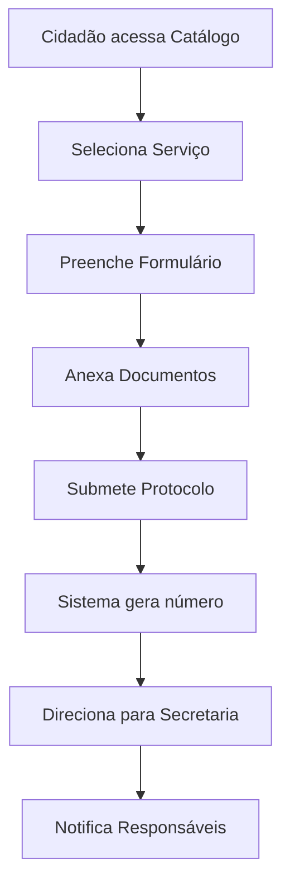
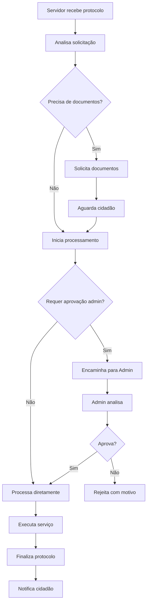
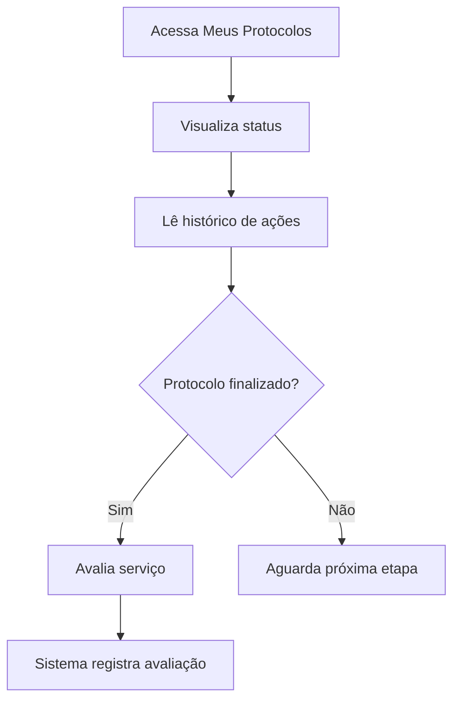

# 📋 Plano Completo de Integração com Supabase

## 🎯 **Objetivo**

Integrar completamente a aplicação Digiurban com o Supabase para fornecer persistência de dados robusta, segura e escalável, garantindo o funcionamento completo do sistema de protocolos municipais.

---

## 📊 **Análise da Arquitetura Atual**

### **🏗️ Estrutura da Aplicação**

**Frontend (React + TypeScript + Vite):**
- **Portal Admin:** Sistema completo com 12+ secretarias e 100+ módulos
- **Portal Cidadão:** Interface simplificada (Catálogo de Serviços, Protocolos, Chat, Documentos, Avaliações)
- **Autenticação:** Sistema unificado com AuthContext
- **Chat:** Sistema real-time já implementado e funcional

**Backend Atual:**
- **Supabase:** Já configurado com autenticação nativa
- **Banco de Dados:** PostgreSQL com estruturas existentes
- **RLS:** Políticas básicas já implementadas
- **Realtime:** Chat funcionando com subscriptions

### **📁 Estrutura de Dados Existente**

**Tabelas Principais Identificadas:**
```sql
- user_profiles (usuários com tipos: cidadao, admin, servidor)
- secretarias (departamentos municipais)
- setores (subdivisões)
- protocolos (sistema de solicitações)
- atendimentos (gerenciamento de demandas)
- chat_rooms, chat_participants, chat_messages (chat implementado)
```

**Fluxo de Protocolos Atual:**
1. **Cidadão:** Acessa catálogo → solicita serviço → gera protocolo
2. **Sistema:** Direciona para secretaria responsável
3. **Servidor:** Recebe, analisa e processa
4. **Administração:** Valida e aprova (se necessário)
5. **Retorno:** Cidadão acompanha via "Meus Protocolos"

---

## 🔧 **Estrutura de Tabelas Proposta para Supabase**

### **1. Tabelas de Autenticação e Usuários**

```sql
-- Tabela de perfis de usuário (já existe - aprimorar)
CREATE TABLE user_profiles (
  id UUID PRIMARY KEY REFERENCES auth.users(id) ON DELETE CASCADE,
  email TEXT UNIQUE NOT NULL,
  nome_completo TEXT NOT NULL,
  cpf TEXT UNIQUE,
  telefone TEXT,
  tipo_usuario TEXT CHECK (tipo_usuario IN ('super_admin', 'admin', 'secretario', 'diretor', 'coordenador', 'funcionario', 'atendente', 'cidadao')),
  perfil_acesso_id UUID REFERENCES perfis_acesso(id),
  secretaria_id UUID REFERENCES secretarias(id),
  setor_id UUID REFERENCES setores(id),
  cargo TEXT,
  status TEXT DEFAULT 'ativo' CHECK (status IN ('ativo', 'inativo', 'suspenso')),
  primeiro_acesso BOOLEAN DEFAULT true,
  endereco JSONB,
  configuracoes JSONB DEFAULT '{}',
  created_at TIMESTAMP WITH TIME ZONE DEFAULT NOW(),
  updated_at TIMESTAMP WITH TIME ZONE DEFAULT NOW()
);
```

### **2. Tabelas de Estrutura Organizacional**

```sql
-- Secretarias municipais
CREATE TABLE secretarias (
  id UUID PRIMARY KEY DEFAULT gen_random_uuid(),
  codigo TEXT UNIQUE NOT NULL,
  nome TEXT NOT NULL,
  sigla TEXT UNIQUE NOT NULL,
  descricao TEXT,
  responsavel_id UUID REFERENCES user_profiles(id),
  email_oficial TEXT,
  telefone TEXT,
  endereco JSONB,
  ativa BOOLEAN DEFAULT true,
  created_at TIMESTAMP WITH TIME ZONE DEFAULT NOW(),
  updated_at TIMESTAMP WITH TIME ZONE DEFAULT NOW()
);

-- Setores/Departamentos
CREATE TABLE setores (
  id UUID PRIMARY KEY DEFAULT gen_random_uuid(),
  secretaria_id UUID NOT NULL REFERENCES secretarias(id) ON DELETE CASCADE,
  nome TEXT NOT NULL,
  descricao TEXT,
  responsavel_id UUID REFERENCES user_profiles(id),
  ativo BOOLEAN DEFAULT true,
  created_at TIMESTAMP WITH TIME ZONE DEFAULT NOW(),
  updated_at TIMESTAMP WITH TIME ZONE DEFAULT NOW()
);
```

### **3. Sistema de Serviços e Protocolos**

```sql
-- Catálogo de serviços municipais
CREATE TABLE servicos_municipais (
  id UUID PRIMARY KEY DEFAULT gen_random_uuid(),
  codigo TEXT UNIQUE NOT NULL,
  nome TEXT NOT NULL,
  descricao TEXT NOT NULL,
  categoria TEXT NOT NULL,
  subcategoria TEXT,
  secretaria_responsavel_id UUID NOT NULL REFERENCES secretarias(id),
  setor_responsavel_id UUID REFERENCES setores(id),
  
  -- Configurações do serviço
  requer_documentos BOOLEAN DEFAULT false,
  documentos_necessarios JSONB DEFAULT '[]',
  prazo_resposta_dias INTEGER DEFAULT 30,
  prazo_resolucao_dias INTEGER DEFAULT 60,
  taxa_servico DECIMAL(10,2) DEFAULT 0,
  
  -- Status e validação
  status TEXT DEFAULT 'ativo' CHECK (status IN ('ativo', 'inativo', 'em_revisao')),
  requer_aprovacao_admin BOOLEAN DEFAULT false,
  aprovado_por UUID REFERENCES user_profiles(id),
  aprovado_em TIMESTAMP WITH TIME ZONE,
  
  -- Metadados
  created_at TIMESTAMP WITH TIME ZONE DEFAULT NOW(),
  updated_at TIMESTAMP WITH TIME ZONE DEFAULT NOW(),
  created_by UUID REFERENCES user_profiles(id)
);

-- Protocolos de solicitações
CREATE TABLE protocolos (
  id UUID PRIMARY KEY DEFAULT gen_random_uuid(),
  numero_protocolo TEXT UNIQUE NOT NULL,
  servico_id UUID NOT NULL REFERENCES servicos_municipais(id),
  
  -- Solicitante
  solicitante_id UUID NOT NULL REFERENCES user_profiles(id),
  dados_solicitante JSONB NOT NULL, -- Nome, CPF, email, telefone, endereço
  
  -- Detalhes da solicitação
  titulo TEXT NOT NULL,
  descricao TEXT NOT NULL,
  dados_especificos JSONB DEFAULT '{}', -- Campos específicos do serviço
  endereco_referencia JSONB, -- Local relacionado à solicitação
  
  -- Responsabilidade
  secretaria_id UUID NOT NULL REFERENCES secretarias(id),
  setor_id UUID REFERENCES setores(id),
  responsavel_atual_id UUID REFERENCES user_profiles(id),
  
  -- Status e controle
  status TEXT DEFAULT 'aberto' CHECK (status IN ('aberto', 'em_andamento', 'aguardando_documentos', 'aguardando_aprovacao', 'aprovado', 'rejeitado', 'concluido', 'cancelado')),
  prioridade TEXT DEFAULT 'media' CHECK (prioridade IN ('baixa', 'media', 'alta', 'urgente')),
  
  -- Prazos
  prazo_resposta TIMESTAMP WITH TIME ZONE,
  prazo_resolucao TIMESTAMP WITH TIME ZONE,
  data_primeira_resposta TIMESTAMP WITH TIME ZONE,
  data_conclusao TIMESTAMP WITH TIME ZONE,
  
  -- Aprovação administrativa
  requer_aprovacao BOOLEAN DEFAULT false,
  aprovado BOOLEAN,
  aprovado_por UUID REFERENCES user_profiles(id),
  aprovado_em TIMESTAMP WITH TIME ZONE,
  observacoes_aprovacao TEXT,
  
  -- Avaliação do cidadão
  avaliacao_nota INTEGER CHECK (avaliacao_nota >= 1 AND avaliacao_nota <= 5),
  avaliacao_comentario TEXT,
  avaliado_em TIMESTAMP WITH TIME ZONE,
  
  -- Metadados
  created_at TIMESTAMP WITH TIME ZONE DEFAULT NOW(),
  updated_at TIMESTAMP WITH TIME ZONE DEFAULT NOW()
);
```

### **4. Sistema de Acompanhamento e Histórico**

```sql
-- Histórico de mudanças nos protocolos
CREATE TABLE protocolos_historico (
  id UUID PRIMARY KEY DEFAULT gen_random_uuid(),
  protocolo_id UUID NOT NULL REFERENCES protocolos(id) ON DELETE CASCADE,
  
  -- Mudança
  acao TEXT NOT NULL, -- 'criado', 'encaminhado', 'atualizado', 'aprovado', 'rejeitado', etc.
  status_anterior TEXT,
  status_novo TEXT,
  dados_anteriores JSONB,
  dados_novos JSONB,
  observacoes TEXT,
  
  -- Responsável pela ação
  usuario_id UUID REFERENCES user_profiles(id),
  usuario_nome TEXT NOT NULL,
  usuario_tipo TEXT NOT NULL,
  
  -- Metadados
  created_at TIMESTAMP WITH TIME ZONE DEFAULT NOW(),
  ip_address INET,
  user_agent TEXT
);

-- Anexos de protocolos
CREATE TABLE protocolos_anexos (
  id UUID PRIMARY KEY DEFAULT gen_random_uuid(),
  protocolo_id UUID NOT NULL REFERENCES protocolos(id) ON DELETE CASCADE,
  
  -- Arquivo
  nome_arquivo TEXT NOT NULL,
  tipo_arquivo TEXT,
  tamanho_bytes BIGINT,
  url_storage TEXT NOT NULL, -- URL no Supabase Storage
  hash_arquivo TEXT,
  
  -- Classificação
  tipo_anexo TEXT DEFAULT 'documento' CHECK (tipo_anexo IN ('documento', 'comprovante', 'foto', 'outro')),
  obrigatorio BOOLEAN DEFAULT false,
  
  -- Metadados
  uploaded_by UUID REFERENCES user_profiles(id),
  created_at TIMESTAMP WITH TIME ZONE DEFAULT NOW()
);

-- Comentários e observações
CREATE TABLE protocolos_comentarios (
  id UUID PRIMARY KEY DEFAULT gen_random_uuid(),
  protocolo_id UUID NOT NULL REFERENCES protocolos(id) ON DELETE CASCADE,
  
  -- Comentário
  comentario TEXT NOT NULL,
  tipo TEXT DEFAULT 'observacao' CHECK (tipo IN ('observacao', 'resposta_oficial', 'solicitacao_documentos')),
  visivel_cidadao BOOLEAN DEFAULT true,
  
  -- Autor
  autor_id UUID REFERENCES user_profiles(id),
  autor_nome TEXT NOT NULL,
  autor_cargo TEXT,
  
  -- Metadados
  created_at TIMESTAMP WITH TIME ZONE DEFAULT NOW(),
  updated_at TIMESTAMP WITH TIME ZONE DEFAULT NOW()
);
```

### **5. Sistema de Notificações**

```sql
-- Notificações do sistema
CREATE TABLE notificacoes (
  id UUID PRIMARY KEY DEFAULT gen_random_uuid(),
  
  -- Destinatário
  usuario_id UUID NOT NULL REFERENCES user_profiles(id),
  
  -- Conteúdo
  titulo TEXT NOT NULL,
  mensagem TEXT NOT NULL,
  tipo TEXT DEFAULT 'info' CHECK (tipo IN ('info', 'sucesso', 'aviso', 'erro', 'protocolo')),
  
  -- Referência (opcional)
  referencia_tipo TEXT, -- 'protocolo', 'chat', etc.
  referencia_id UUID,
  
  -- Status
  lida BOOLEAN DEFAULT false,
  lida_em TIMESTAMP WITH TIME ZONE,
  
  -- Configurações
  push_enviado BOOLEAN DEFAULT false,
  email_enviado BOOLEAN DEFAULT false,
  
  -- Metadados
  created_at TIMESTAMP WITH TIME ZONE DEFAULT NOW()
);
```

---

## 🔒 **Políticas de Row Level Security (RLS)**

### **1. Políticas para user_profiles**

```sql
-- Usuários podem ver e editar seu próprio perfil
CREATE POLICY "users_own_profile" ON user_profiles
  FOR ALL USING (auth.uid() = id);

-- Admins podem ver todos os perfis
CREATE POLICY "admins_view_all_profiles" ON user_profiles
  FOR SELECT USING (
    EXISTS (
      SELECT 1 FROM user_profiles 
      WHERE id = auth.uid() 
      AND tipo_usuario IN ('super_admin', 'admin')
    )
  );

-- Servidores podem ver perfis da mesma secretaria
CREATE POLICY "servers_view_same_department" ON user_profiles
  FOR SELECT USING (
    secretaria_id IN (
      SELECT secretaria_id FROM user_profiles 
      WHERE id = auth.uid()
    )
    OR tipo_usuario = 'cidadao' -- Servidores podem ver cidadãos
  );
```

### **2. Políticas para protocolos**

```sql
-- Cidadãos podem ver apenas seus próprios protocolos
CREATE POLICY "citizens_own_protocols" ON protocolos
  FOR SELECT USING (
    solicitante_id = auth.uid()
  );

-- Cidadãos podem criar protocolos
CREATE POLICY "citizens_create_protocols" ON protocolos
  FOR INSERT WITH CHECK (
    solicitante_id = auth.uid() AND
    EXISTS (
      SELECT 1 FROM user_profiles 
      WHERE id = auth.uid() AND tipo_usuario = 'cidadao'
    )
  );

-- Servidores podem ver protocolos de sua responsabilidade
CREATE POLICY "servers_responsible_protocols" ON protocolos
  FOR SELECT USING (
    secretaria_id IN (
      SELECT secretaria_id FROM user_profiles 
      WHERE id = auth.uid()
    )
    OR responsavel_atual_id = auth.uid()
  );

-- Admins podem ver todos os protocolos
CREATE POLICY "admins_all_protocols" ON protocolos
  FOR ALL USING (
    EXISTS (
      SELECT 1 FROM user_profiles 
      WHERE id = auth.uid() 
      AND tipo_usuario IN ('super_admin', 'admin')
    )
  );
```

### **3. Políticas para serviços municipais**

```sql
-- Todos podem ver serviços ativos
CREATE POLICY "public_view_active_services" ON servicos_municipais
  FOR SELECT USING (status = 'ativo');

-- Apenas admins podem modificar serviços
CREATE POLICY "admins_manage_services" ON servicos_municipais
  FOR ALL USING (
    EXISTS (
      SELECT 1 FROM user_profiles 
      WHERE id = auth.uid() 
      AND tipo_usuario IN ('super_admin', 'admin')
    )
  );

-- Secretários podem criar serviços para sua secretaria
CREATE POLICY "secretaries_create_services" ON servicos_municipais
  FOR INSERT WITH CHECK (
    secretaria_responsavel_id IN (
      SELECT secretaria_id FROM user_profiles 
      WHERE id = auth.uid() AND tipo_usuario IN ('secretario', 'diretor')
    )
  );
```

---

## 🔐 **Estratégia de Autenticação e Controle de Permissões**

### **1. Sistema de Autenticação**

**Supabase Auth Nativo:**
- ✅ **Já implementado e funcionando**
- **Email/Password** para todos os tipos de usuário
- **Confirmação de email** para cidadãos
- **Reset de senha** via email

**AuthContext Unificado:**
- ✅ **Já implementado**
- Gerencia estado de autenticação
- Carrega perfil e permissões automaticamente
- Funções de verificação de acesso

### **2. Controle de Permissões por Tipo de Usuário**

**Cidadão:**
- ✅ Criar protocolos
- ✅ Visualizar seus protocolos
- ✅ Avaliar serviços
- ✅ Chat com suporte
- ✅ Acesso ao catálogo de serviços

**Funcionário/Atendente:**
- ✅ Visualizar protocolos de sua secretaria
- ✅ Atualizar status de protocolos
- ✅ Adicionar comentários
- ✅ Chat interno

**Secretário/Diretor:**
- ✅ Gerenciar protocolos da secretaria
- ✅ Criar novos serviços
- ✅ Aprovar serviços
- ✅ Relatórios departamentais

**Admin/Super Admin:**
- ✅ Acesso total ao sistema
- ✅ Gerenciar usuários
- ✅ Aprovar protocolos críticos
- ✅ Configurar sistema
- ✅ Relatórios gerais

---

## 📈 **Fluxo Completo do Protocolo**

### **1. Criação pelo Cidadão**



### **2. Processamento pela Administração**



### **3. Acompanhamento pelo Cidadão**



---

## 🚀 **Estratégia de Migração e Implementação**

### **Fase 1: Preparação (Não afeta produção)**

✅ **1.1 Ambiente de Desenvolvimento**
- Criar projeto Supabase separado para testes
- Configurar todas as tabelas propostas
- Implementar políticas RLS
- Testar com dados fictícios

✅ **1.2 Adaptação do Código**
- Criar serviços para APIs do Supabase
- Adaptar componentes para nova estrutura
- Implementar hooks para gerenciamento de estado
- Testes unitários e de integração

### **Fase 2: Implementação Modular**

**2.1 Sistema de Serviços Municipais**
```typescript
// src/lib/services.ts
export const servicosService = {
  async listarServicos(categoria?: string) {
    const { data } = await supabase
      .from('servicos_municipais')
      .select('*')
      .eq('status', 'ativo')
      .order('nome');
    return data;
  },

  async criarServico(dadosServico) {
    const { data } = await supabase
      .from('servicos_municipais')
      .insert(dadosServico)
      .select()
      .single();
    return data;
  }
};
```

**2.2 Sistema de Protocolos**
```typescript
// src/lib/protocolos.ts
export const protocolosService = {
  async criarProtocolo(dadosProtocolo) {
    const { data } = await supabase
      .from('protocolos')
      .insert({
        ...dadosProtocolo,
        numero_protocolo: await this.gerarNumeroProtocolo(),
        solicitante_id: (await supabase.auth.getUser()).data.user?.id
      })
      .select()
      .single();
    
    // Registrar no histórico
    await this.registrarHistorico(data.id, 'criado', 'Protocolo criado pelo cidadão');
    
    return data;
  },

  async atualizarStatus(protocoloId, novoStatus, observacoes) {
    const { data: protocolo } = await supabase
      .from('protocolos')
      .select('status')
      .eq('id', protocoloId)
      .single();

    const { data } = await supabase
      .from('protocolos')
      .update({ 
        status: novoStatus,
        updated_at: new Date().toISOString()
      })
      .eq('id', protocoloId)
      .select()
      .single();

    // Registrar mudança no histórico
    await this.registrarHistorico(
      protocoloId, 
      'status_alterado', 
      `Status alterado de ${protocolo.status} para ${novoStatus}`,
      { observacoes }
    );

    return data;
  }
};
```

**2.3 Sistema de Notificações**
```typescript
// src/lib/notifications.ts
export const notificacoesService = {
  async criarNotificacao(usuarioId, titulo, mensagem, tipo = 'info', referenciaId?) {
    return await supabase
      .from('notificacoes')
      .insert({
        usuario_id: usuarioId,
        titulo,
        mensagem,
        tipo,
        referencia_id: referenciaId
      });
  },

  async marcarComoLida(notificacaoId) {
    return await supabase
      .from('notificacoes')
      .update({ 
        lida: true, 
        lida_em: new Date().toISOString() 
      })
      .eq('id', notificacaoId);
  },

  // Subscription para notificações em tempo real
  subscribeToNotifications(usuarioId, callback) {
    return supabase
      .channel('notifications')
      .on('postgres_changes', {
        event: 'INSERT',
        schema: 'public',
        table: 'notificacoes',
        filter: `usuario_id=eq.${usuarioId}`
      }, callback)
      .subscribe();
  }
};
```

### **Fase 3: Testes e Validação**

**3.1 Ambiente de Staging**
- Deploy da aplicação integrada em ambiente de teste
- Testes com usuários reais em cenários controlados
- Validação de performance e segurança
- Ajustes baseados em feedback

**3.2 Migração de Dados (Se aplicável)**
- Script para migrar dados existentes
- Validação de integridade dos dados
- Backup completo antes da migração

### **Fase 4: Deploy em Produção**

**4.1 Deploy Controlado**
- Manutenção programada (fora do horário comercial)
- Deploy da nova versão
- Validação imediata de funcionalidades críticas
- Rollback automático se necessário

**4.2 Monitoramento Pós-Deploy**
- Monitoramento de erros e performance
- Suporte dedicado nas primeiras 48h
- Ajustes de emergência se necessário

---

## 📦 **Sugestões de Versionamento e Ambiente Paralelo**

### **1. Estratégia de Branches**

```bash
# Estrutura de branches
main/              # Produção atual
├── develop/       # Desenvolvimento principal
├── feature/supabase-integration  # Integração Supabase
├── staging/       # Ambiente de testes
└── hotfix/        # Correções emergenciais
```

### **2. Ambiente Paralelo**

**Configuração de Múltiplos Ambientes:**
```typescript
// src/lib/supabase.ts
const supabaseConfig = {
  development: {
    url: process.env.VITE_SUPABASE_DEV_URL,
    key: process.env.VITE_SUPABASE_DEV_ANON_KEY
  },
  staging: {
    url: process.env.VITE_SUPABASE_STAGING_URL,
    key: process.env.VITE_SUPABASE_STAGING_ANON_KEY
  },
  production: {
    url: process.env.VITE_SUPABASE_URL,
    key: process.env.VITE_SUPABASE_ANON_KEY
  }
};

export const supabase = createClient(
  supabaseConfig[process.env.NODE_ENV].url,
  supabaseConfig[process.env.NODE_ENV].key
);
```

### **3. Feature Flags**

```typescript
// src/lib/features.ts
export const features = {
  useSupabaseProtocols: process.env.VITE_FEATURE_SUPABASE_PROTOCOLS === 'true',
  useSupabaseNotifications: process.env.VITE_FEATURE_SUPABASE_NOTIFICATIONS === 'true',
  useSupabaseStorage: process.env.VITE_FEATURE_SUPABASE_STORAGE === 'true'
};

// Uso condicional
if (features.useSupabaseProtocols) {
  // Nova implementação
  return await protocolosService.criarProtocolo(dados);
} else {
  // Implementação atual
  return await oldProtocolService.create(dados);
}
```

---

## ⚠️ **Cuidados na Migração**

### **1. Backup e Segurança**

- ✅ **Backup completo** dos dados atuais antes de qualquer alteração
- ✅ **Backup incremental** durante o processo de migração
- ✅ **Teste de restore** para garantir que backups funcionam
- ✅ **Criptografia** de dados sensíveis durante transferência

### **2. Compatibilidade Reversa**

```typescript
// Exemplo de código compatível
export class ProtocolService {
  async createProtocol(data: ProtocolData) {
    if (features.useSupabaseProtocols) {
      // Nova implementação com Supabase
      return await this.createProtocolSupabase(data);
    } else {
      // Implementação atual
      return await this.createProtocolLegacy(data);
    }
  }

  // Permite rollback imediato se necessário
  async createProtocolSupabase(data: ProtocolData) {
    try {
      return await protocolosService.criarProtocolo(data);
    } catch (error) {
      console.error('Supabase error, falling back to legacy:', error);
      return await this.createProtocolLegacy(data);
    }
  }
}
```

### **3. Monitoramento e Logs**

```typescript
// src/lib/monitoring.ts
export const logger = {
  logProtocolAction(action: string, protocolId: string, metadata?: any) {
    console.log(`[PROTOCOL] ${action}:`, { protocolId, metadata, timestamp: new Date() });
    
    // Enviar para serviço de monitoramento (Sentry, etc.)
    if (process.env.NODE_ENV === 'production') {
      // analytics.track('protocol_action', { action, protocolId, metadata });
    }
  },

  logError(error: Error, context?: any) {
    console.error('[ERROR]', error, context);
    // Enviar erro para monitoramento
  }
};
```

### **4. Validação de Dados**

```typescript
// src/lib/validation.ts
import { z } from 'zod';

export const protocolSchema = z.object({
  titulo: z.string().min(5).max(200),
  descricao: z.string().min(10).max(2000),
  servico_id: z.string().uuid(),
  dados_especificos: z.object({}).optional(),
  endereco_referencia: z.object({
    cep: z.string().optional(),
    logradouro: z.string().optional(),
    numero: z.string().optional(),
    bairro: z.string().optional()
  }).optional()
});

export const validateProtocol = (data: any) => {
  return protocolSchema.parse(data);
};
```

---

## 🎯 **Cronograma Sugerido**

| Fase | Atividade | Tempo Estimado | Status |
|------|-----------|----------------|--------|
| **Preparação** | Configurar Supabase Dev | 2 dias | ⏳ |
| | Criar estrutura de tabelas | 3 dias | ⏳ |
| | Implementar políticas RLS | 2 dias | ⏳ |
| **Desenvolvimento** | Serviços de API | 5 dias | ⏳ |
| | Adaptação de componentes | 5 dias | ⏳ |
| | Sistema de notificações | 3 days | ⏳ |
| **Testes** | Testes unitários | 3 dias | ⏳ |
| | Testes de integração | 3 dias | ⏳ |
| | Testes com usuários | 2 dias | ⏳ |
| **Deploy** | Ambiente staging | 1 dia | ⏳ |
| | Deploy produção | 1 dia | ⏳ |
| **Total** | | **30 dias** | |

---

## ✅ **Checklist de Implementação**

### **Pré-requisitos**
- [ ] Backup completo dos dados atuais
- [ ] Configuração do Supabase de desenvolvimento
- [ ] Configuração do Supabase de staging
- [ ] Revisão de códigos existentes

### **Desenvolvimento**
- [ ] Criação de todas as tabelas no Supabase
- [ ] Implementação das políticas RLS
- [ ] Desenvolvimento dos serviços de API
- [ ] Adaptação dos componentes React
- [ ] Sistema de notificações em tempo real
- [ ] Sistema de upload de arquivos
- [ ] Testes unitários
- [ ] Testes de integração

### **Segurança**
- [ ] Validação de todas as políticas RLS
- [ ] Teste de acesso não autorizado
- [ ] Criptografia de dados sensíveis
- [ ] Logs de auditoria
- [ ] Revisão de segurança completa

### **Performance**
- [ ] Otimização de queries
- [ ] Índices de banco de dados
- [ ] Cache de dados frequentes
- [ ] Testes de carga
- [ ] Monitoramento de performance

### **Deploy**
- [ ] Deploy em ambiente de staging
- [ ] Testes finais com dados reais
- [ ] Plano de rollback testado
- [ ] Deploy em produção
- [ ] Monitoramento pós-deploy
- [ ] Validação de funcionalidades críticas

---

## 🎉 **Resultado Esperado**

Ao final da implementação, teremos:

✅ **Sistema Robusto:** Persistência segura e escalável no Supabase
✅ **Fluxo Completo:** Cidadão → Servidor → Administração funcionando perfeitamente
✅ **Segurança:** RLS garantindo acesso adequado para cada tipo de usuário
✅ **Real-time:** Notificações e atualizações instantâneas
✅ **Auditoria:** Histórico completo de todas as ações
✅ **Escalabilidade:** Sistema preparado para crescimento
✅ **Manutenibilidade:** Código organizado e bem documentado

---

*Este plano garante uma integração segura, escalável e reversível, mantendo a aplicação estável durante todo o processo de migração.*